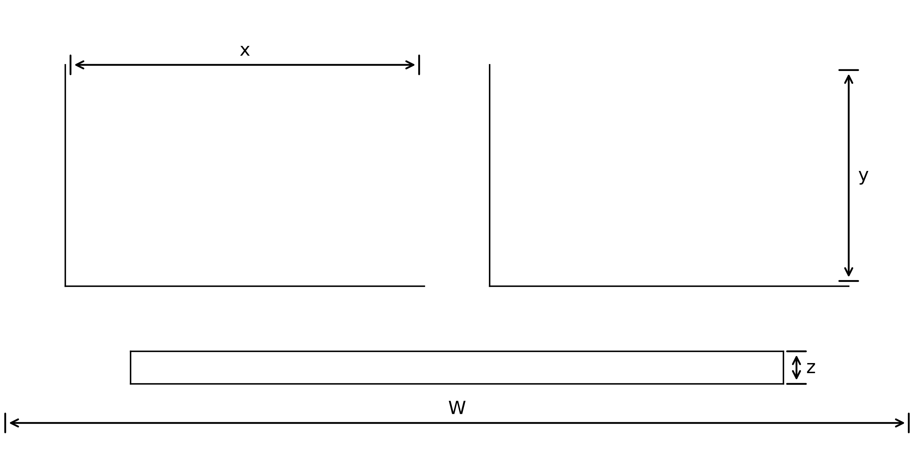
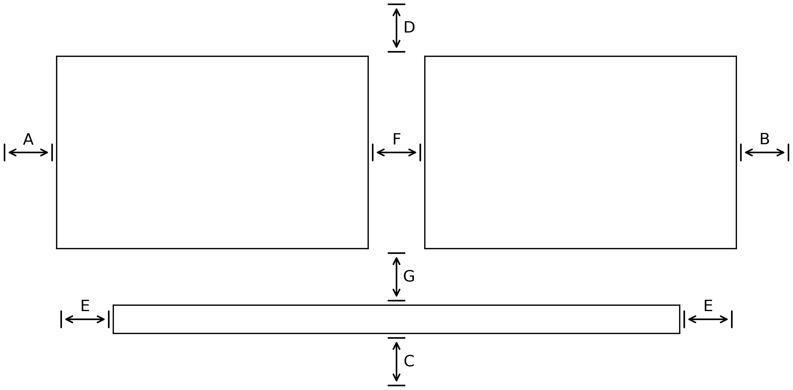

Using faceted
=============

:py:meth:`faceted.faceted` is quite flexible.  Here are a couple of examples
illustrating the different features.  Using it in many ways resembles using
:py:meth:`matplotlib.pyplot.subplots`. 

.. ipython:: python
    :okwarning:

    import matplotlib.pyplot as plt
    import xarray as xr
    from matplotlib import ticker
    from faceted import faceted

    tick_locator = ticker.MaxNLocator(nbins=3)
    
    ds = xr.tutorial.load_dataset('rasm').isel(x=slice(30, 37), y=-1,
                                               time=slice(0, 11))
    temp = ds.Tair
    
    fig, axes = faceted(2, 3, width=8, aspect=0.618)
    for i, ax in enumerate(axes):
        temp.isel(x=i).plot(ax=ax, marker='o', ls='none')
        ax.set_title('{:0.2f}'.format(temp.xc.isel(x=i).item()))
        ax.set_xlabel('Time')
        ax.set_ylabel('Temperature [C]')
        ax.tick_params(axis='x', labelrotation=45)

    @savefig example_tair_base.png
    fig.show()

        
Padding options
---------------

We'll notice that there are some padding issues in the above plot.  We can add
some padding using the outer and inner padding arguments.  Specifying an
``internal_pad`` as a tuple allows us to prescribe different horizontal and
vertical pad values; specifying a ``left_pad`` and ``bottom_pad`` allows us to
make room for the outer axes labels, while maintaining our prescribed figure
width. 

.. ipython:: python
    :okwarning:

    fig, axes = faceted(2, 3, width=8, aspect=0.618, left_pad=0.75, bottom_pad=0.9,
                        internal_pad=(0.33, 0.66))
    for i, ax in enumerate(axes):
        temp.isel(x=i).plot(ax=ax, marker='o', ls='none')
        ax.set_title('{:0.2f}'.format(temp.xc.isel(x=i).item()))
        ax.set_xlabel('Time')
        ax.set_ylabel('Temperature [C]')
        ax.tick_params(axis='x', labelrotation=45)

    @savefig example_tair_padding.png
    fig.show()
        
Sharing axes
------------

By default all axes are shared among the panels.  Let's say we wanted to plot a
different quantity on the bottom row of panels, so the y-axis would be
different.  Making use of the xarray tutorial dataset, we can plot an anomaly
from the time mean at each location in the lower row instead.

.. ipython:: python
    :okwarning:

    import numpy as np
             
    index = ds.indexes['time']
    time_weights = index.shift(1, 'MS') - index.shift(-1, 'MS')
    time_weights = xr.DataArray(time_weights, ds.time.coords)
    mean = (ds.Tair * time_weights).sum('time') / time_weights.where(np.isfinite(ds.Tair)).sum('time')
    anomaly = ds.Tair - mean
    
    fig, axes = faceted(2, 3, width=8, aspect=0.618, left_pad=0.75, bottom_pad=0.9,
                        internal_pad=(0.33, 0.66), sharey='row')
    for i, ax in enumerate(axes[:3]):
        temp.isel(x=i).plot(ax=ax, marker='o', ls='none')
        ax.set_title('{:0.2f}'.format(temp.xc.isel(x=i).item()))
        ax.set_xlabel('Time')
        ax.set_ylabel('Temperature [C]')

    for i, ax in enumerate(axes[3:]):
        anomaly.isel(x=i).plot(ax=ax, marker='o', ls='none')
        ax.set_title('{:0.2f}'.format(temp.xc.isel(x=i).item()))
        ax.set_xlabel('Time')
        ax.set_ylabel('Anomaly [C]')
        ax.tick_params(axis='x', labelrotation=45)
        
    @savefig example_tair_share_axes.png
    fig.show()

Types of constrained figures
----------------------------

:py:meth:`faceted.faceted` supports multiple kinds of constrained figures.  We simply need
to provide exactly two of the ``width``, ``height``, and ``aspect`` arguments and :py:meth:`faceted.faceted`
does the rest.

Width-and-aspect constrained figure
###################################

This is what we've shown already, but for completeness we'll repeat the example again here.

.. ipython:: python
    :okwarning:

    import matplotlib.pyplot as plt
    import xarray as xr
    from matplotlib import ticker
    from faceted import faceted

    tick_locator = ticker.MaxNLocator(nbins=3)
    
    ds = xr.tutorial.load_dataset('rasm').isel(x=slice(30, 37), y=-1,
                                               time=slice(0, 11))
    temp = ds.Tair
    
    fig, axes = faceted(2, 3, width=8, aspect=0.618, bottom_pad=0.9, left_pad=0.75,
                        internal_pad=(0.33, 0.66), sharey='row')
    for i, ax in enumerate(axes):
        temp.isel(x=i).plot(ax=ax, marker='o', ls='none')
        ax.set_title('{:0.2f}'.format(temp.xc.isel(x=i).item()))
        ax.set_xlabel('Time')
        ax.set_ylabel('Temperature [C]')
        ax.tick_params(axis='x', labelrotation=45)

    @savefig example_tair_base_width_and_aspect.png
    fig.show()

Height-and-aspect constrained figure
####################################

.. ipython:: python
    :okwarning:

    import matplotlib.pyplot as plt
    import xarray as xr
    from matplotlib import ticker
    from faceted import faceted

    tick_locator = ticker.MaxNLocator(nbins=3)
    
    ds = xr.tutorial.load_dataset('rasm').isel(x=slice(30, 37), y=-1,
                                               time=slice(0, 11))
    temp = ds.Tair
    
    fig, axes = faceted(2, 3, height=8., aspect=0.618, bottom_pad=0.9, left_pad=0.75,
                        internal_pad=(0.33, 0.66), sharey='row')
    for i, ax in enumerate(axes):
        temp.isel(x=i).plot(ax=ax, marker='o', ls='none')
        ax.set_title('{:0.2f}'.format(temp.xc.isel(x=i).item()))
        ax.set_xlabel('Time')
        ax.set_ylabel('Temperature [C]')
        ax.tick_params(axis='x', labelrotation=45)

    @savefig example_tair_base_height_and_aspect.png
    fig.show()

Width-and-height constrained figure
###################################
    
.. ipython:: python
    :okwarning:

    import matplotlib.pyplot as plt
    import xarray as xr
    from matplotlib import ticker
    from faceted import faceted

    tick_locator = ticker.MaxNLocator(nbins=3)
    
    ds = xr.tutorial.load_dataset('rasm').isel(x=slice(30, 37), y=-1,
                                               time=slice(0, 11))
    temp = ds.Tair
    
    fig, axes = faceted(2, 3, width=8, height=6., bottom_pad=0.9, left_pad=0.75,
                        internal_pad=(0.33, 0.66), sharey='row')
    for i, ax in enumerate(axes):
        temp.isel(x=i).plot(ax=ax, marker='o', ls='none')
        ax.set_title('{:0.2f}'.format(temp.xc.isel(x=i).item()))
        ax.set_xlabel('Time')
        ax.set_ylabel('Temperature [C]')
        ax.tick_params(axis='x', labelrotation=45)

    @savefig example_tair_base_width_and_height.png
    fig.show()

Colorbar modes and locations
----------------------------

Let's say we are plotting 2D data in the form of pcolormesh plots that require
a colorbar.  :py:meth:`faceted.faceted` comes with a number of options for placing and sizing
colorbars in a paneled figure.  We can add a colorbar to a figure by modifying
the ``cbar_mode`` argument; by default it is set to ``None``, meaning no
colorbar, as in the plots above.  For all of the examples here, we'll just plot
a time series of maps.  Since the xarray tutorial data is geographic in nature,
we'll also use this opportunity to show how to use :py:mod:`cartopy` with
:py:meth:`faceted.faceted`.

Single colorbar
###############

A single colorbar is useful when we use the same color scale for all panels of
a figure.  

.. ipython:: python
    :okwarning:

    import cartopy.crs as ccrs

    ds = xr.tutorial.load_dataset('air_temperature')

    aspect = 60. / 130.
    fig, axes, cax = faceted(2, 3, width=8, aspect=aspect,
                            bottom_pad=0.75, cbar_mode='single',
                            cbar_pad=0.1, internal_pad=0.1,
                            cbar_location='bottom', cbar_short_side_pad=0.,
                            axes_kwargs={'projection': ccrs.PlateCarree()})
    for i, ax in enumerate(axes):
        c = ds.air.isel(time=i).plot(
            ax=ax, add_colorbar=False, transform=ccrs.PlateCarree(),
            vmin=230, vmax=305)
        ax.set_title('')
        ax.set_xlabel('')
        ax.set_ylabel('')
        ax.set_extent([-160, -30, 15, 75], crs=ccrs.PlateCarree())
        ax.coastlines()

    plt.colorbar(c, cax=cax, orientation='horizontal', label='Temperature [C]');
        
    @savefig example_tair_single_cbar.png
    fig.show()

Edge colorbars
##############

Edge colorbars are useful when rows or columns of a figure share a colorbar.
We'll show an example where the rows share a colorbar.

.. ipython:: python
    :okwarning:

    aspect = 60. / 130.
    fig, axes, (cax1, cax2) = faceted(2, 3, width=8, aspect=aspect, right_pad=0.75,
                                      cbar_mode='edge',
                                      cbar_pad=0.1, internal_pad=0.1,
                                      cbar_location='right', cbar_short_side_pad=0.,
                                      axes_kwargs={'projection': ccrs.PlateCarree()})
    for i, ax in enumerate(axes[:3]):
        c1 = ds.air.isel(time=i).plot(
            ax=ax, add_colorbar=False, transform=ccrs.PlateCarree(),
            vmin=230, vmax=305)
        ax.set_title('')
        ax.set_xlabel('')
        ax.set_ylabel('')
        ax.set_extent([-160, -30, 15, 75], crs=ccrs.PlateCarree())
        ax.coastlines()

    plt.colorbar(c1, cax=cax1, label='[C]');

    for i, ax in enumerate(axes[3:], start=3):
        c2 = ds.air.isel(time=i).plot(
            ax=ax, add_colorbar=False, transform=ccrs.PlateCarree(),
            vmin=230, vmax=305)
        ax.set_title('')
        ax.set_xlabel('')
        ax.set_ylabel('')
        ax.set_extent([-160, -30, 15, 75], crs=ccrs.PlateCarree())
        ax.coastlines()

    plt.colorbar(c2, cax=cax2, label='[C]');
        
    @savefig example_tair_edge_cbar.png
    fig.show()

Colorbars for each panel
########################

One more common use case is a colorbar for each panel.  This can be done by
specifying ``cbar_mode='each'`` as an argument in the call to :py:meth:`faceted.faceted`.

.. ipython:: python
    :okwarning:

    tick_locator = ticker.MaxNLocator(nbins=3)
    
    aspect = 60. / 130.
    fig, axes, caxes = faceted(2, 3, width=8, aspect=aspect, right_pad=0.75,
                               cbar_mode='each',
                               cbar_pad=0.1, internal_pad=(0.75, 0.1),
                               cbar_location='right', cbar_short_side_pad=0.,
                               axes_kwargs={'projection': ccrs.PlateCarree()})
    for i, (ax, cax) in enumerate(zip(axes, caxes)):
        c = ds.air.isel(time=i).plot(
            ax=ax, add_colorbar=False, transform=ccrs.PlateCarree(),
            cmap='viridis', vmin=230, vmax=305)
        ax.set_title('')
        ax.set_xlabel('')
        ax.set_ylabel('')
        ax.set_extent([-160, -30, 15, 75], crs=ccrs.PlateCarree())
        ax.coastlines()
        cb = plt.colorbar(c, cax=cax, label='[C]')
        cb.locator = tick_locator
        cb.update_ticks()
        
    @savefig example_tair_each_cbar.png
    fig.show()

Creating a single-axis figure
-----------------------------

For convenience, :py:mod:`faceted` comes with a function built specifically for creating
single-axis figures called :py:meth:`faceted.faceted_ax`.  It takes alls the same keyword
arguments as :py:meth:`faceted.faceted` but returns scalar ``Axes`` objects.

.. ipython:: python
    :okwarning:

    from faceted import faceted_ax

    tick_locator = ticker.MaxNLocator(nbins=3)
    
    aspect = 60. / 130.
    fig, ax, cax = faceted_ax(width=8, aspect=aspect, right_pad=0.75,
                              cbar_mode='each',
                              cbar_pad=0.1, internal_pad=(0.75, 0.1),
                              cbar_location='right', cbar_short_side_pad=0.,
    c = ds.air.isel(time=0).plot(
        ax=ax, add_colorbar=False, transform=ccrs.PlateCarree(),
        cmap='viridis', vmin=230, vmax=305)
    ax.set_title('')
    ax.set_xlabel('')
    ax.set_ylabel('')
    ax.set_extent([-160, -30, 15, 75], crs=ccrs.PlateCarree())
    ax.coastlines()
    cb = plt.colorbar(c, cax=cax, label='[C]')
    cb.locator = tick_locator
    cb.update_ticks()
        
    @savefig example_tair_each_cbar_faceted_ax.png
    fig.show()

Parameter defintions
--------------------

A full summary of the meanings of the different arguments to :py:meth:`faceted.faceted` can be
found here.  

Parameters controlling figure and axes dimensions
#################################################

- W: ``width`` controls the overall width of the figure in inches.
- y / x: ``aspect`` controls the aspect ratio of the panels.
- z: ``cbar_size`` controls the thickness of the colorbar in inches.

Parameters controlling padding
##############################

- A: ``left_pad`` controls the spacing between the left-most axes and the edge
  of the figure in inches.
- B: ``right_pad`` controls the spacing between the right-most axes and the
  edge of the figure in inches.
- C: ``bottom_pad`` controls the spacing between the bottom-most axes and the
  edge of the figure in inches.
- D: ``top_pad`` controls the spacing between the top-most axes and the edge of
  the figure in inches.
- E: ``cbar_short_side_pad`` controls the spacing between the edges of the
  colorbar and the edges of the axes in inches.
- F: ``internal_pad`` controls the spacing between the non-colorbar axes in
  inches. It can either be a number (and specify the horizontal and vertical
  pad at the same time) or it can be a length-two sequence (and specify both
  the horizontal and vertical pads, respectively).
- G: ``cbar_pad`` controls the spacing (in inches) between the edge of the
  non-colorbar axes and the colorbar axes.
