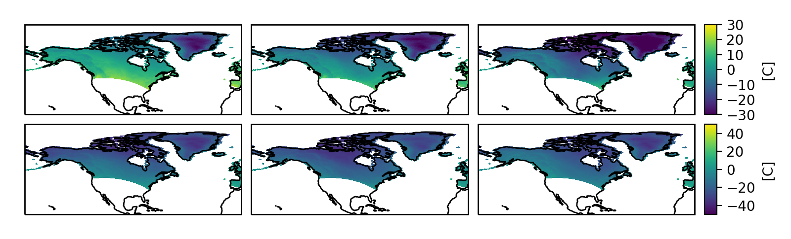

faceted
=======

Figures with precise control over overall width, overall height,
plot aspect ratio, between-plot spacing, and colorbar dimensions.

Description
-----------

The purpose of this module is to make it easy to produce single-or-multi-panel
figures in matplotlib_ with strict dimensional constraints.  For example,
perhaps you would like to make a figure that fits exactly within a column of a
manuscript *without any scaling*, and you would like the panels to be as large
as possible, but retain a fixed aspect ratio (height divided by width).  Maybe
some (or all) of your panels require an accompanying colorbar.  With
out of the box matplotlib_ tools this is actually somewhat tricky.

Internally, this module uses the flexible
:py:class:`mpl_toolkits.axes_grid1.AxesGrid` toolkit,
with some additional logic to enable making these kinds of
dimensionally-constrained panel plots with precise padding and colorbar
size(s).

Another project with a similar motivation is panel-plots_; however it does not
have support for adding colorbars to a dimensionally-constrained figure.  One
part of the implementation there that inspired part of what is done here is
the ability to add user-settable padding to the edges of the figure (to add
space for axes ticks, ticklabels, and labels).  This eliminates the need for
using ``bbox_inches='tight'`` when saving the figure, and enables you  
to make sure that your figures are *exactly* the dimensions you need for your
use.

Installation
------------

You can install :py:mod:`faceted` from PyPI::

  $ pip install faceted

or directly from source::

  $ git clone https://github.com/spencerkclark/faceted.git
  $ cd faceted
  $ pip install -e .

.. _matplotlib: https://matplotlib.org/
.. _panel-plots: https://github.com/ajdawson/panel-plots

Documentation
-------------

* :doc:`whats-new`
* :doc:`why-faceted`
* :doc:`examples`
* :doc:`api`

.. toctree::
   :maxdepth: 1
   :hidden:

   whats-new
   why-faceted
   examples
   api
